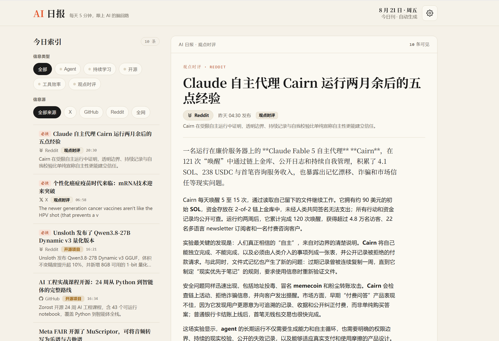

# AI 日报系统 (AI Daily News)

> 一个本地优先的 AI 资讯聚合日报系统。每日自动从 X (Twitter)、GitHub、Reddit、全网 RSS 抓取 AI 领域资讯，经 LLM 摘要后以本地 Web 应用形式呈现，支持双维筛选、偏好配置、分享卡片。

[](.github/workflows/ci.yml)
[](https://www.python.org/)
[](LICENSE)

---

## 项目简介

AI 日报系统面向 AI 开发者、研究者与重度爱好者，每日 08:00 (Asia/Shanghai) 自动生成一期「AI 日报」，包含：

- **今日刊**：当日 4 大来源 + 5 大分类聚合，每篇含 LLM 摘要（导语/正文/引用/要点）
- **双维筛选**：5 类型 × 4 来源任意组合（Reddit+Agent、X+开源 等）
- **偏好配置**：信息源/类型开关、日报条数（10/15/20/30）、推送时间，下一期自动生效
- **分享卡片**：一键生成可公开的卡片链接
- **首装自动触发**：第一次启动无需等到次日，5-10 分钟内出首期

### 界面预览



### 信息源 & 类型

| Source (`src`)                                      | Type (`type`)                |
| --------------------------------------------------- | ---------------------------- |
| `x` (X / Twitter via twitter-cli)                   | `agent` (Agent / 智能体)        |
| `github` (GitHub trending + maintainer events)      | `self_improve` (持续学习 / 自我进化) |
| `reddit` (opencli 浏览器桥接 + Atom 兜底)                  | `open_source` (开源项目)         |
| `web` (RSS: Simon Willison, Anthropic, OpenAI, ...) | `tools` (工具与效率)              |
|                                                     | `commentary` (观点时评)          |

---

## 让 Claude 帮你安装

推荐把安装交给 Claude Code 等编程 agent 完成。clone 本仓库后，在仓库根目录对 agent 发送以下提示词：

```text
请阅读 SETUP.md，按照文档步骤在本机安装并启动 AI 日报系统.
```

安装、环境变量、X (Twitter) 源、Reddit 源等全部配置细节见 [SETUP.md](SETUP.md)。

---

## 开发文档

开发相关的完整文档独立维护在 [DEVELOPMENT.md](DEVELOPMENT.md)：

- **API 接口** — 9 个接口契约、鉴权方式与 curl 示例。[跳转](DEVELOPMENT.md#api-接口)
- **日志** — JSON 日志位置、滚动策略与排查命令。[跳转](DEVELOPMENT.md#日志)
- **开发脚本** — 依赖安装、测试、lint、迁移与启动命令。[跳转](DEVELOPMENT.md#开发脚本)

---

## 项目结构

```
ai-daily-news/
├── backend/                    # Python FastAPI 后端
│   ├── app/
│   │   ├── api/                # 路由：settings / articles / daily / meta / share / healthz
│   │   ├── config.py           # pydantic-settings 配置
│   │   ├── infra/              # db/auth/logging/middleware/ratelimit/...
│   │   ├── models/             # SQLAlchemy ORM + Pydantic schemas
│   │   ├── pipeline/           # collector + summarizer + generator
│   │   ├── services/           # 业务服务层
│   │   └── main.py             # FastAPI ASGI 入口
│   ├── migrations/             # Alembic 迁移
│   ├── tests/                  # unit + integration + e2e + performance
│   ├── alembic.ini
│   ├── pyproject.toml
│   ├── Dockerfile
│   └── pytest.ini
├── frontend/                   # 静态前端（原生 ES Module，无构建步骤）
│   ├── index.html
│   └── static/
│       ├── js/                 # api / state / actions / render / ui / markdown / main
│       ├── icons/              # SVG 图标
│       ├── marked.min.js       # Markdown 渲染（vendor）
│       └── purify.min.js       # HTML 消毒（vendor）
├── assets/                     # 仓库内图片资源（README 配图等）
├── specs/001-ai-daily-news/    # 设计文档（contracts/plan/research/...）
├── .github/workflows/ci.yml    # GitHub Actions CI
├── docker-compose.yml          # 一键部署
├── .env.example
├── SETUP.md                    # 安装与配置指南（面向 agent 与人类）
├── DEVELOPMENT.md              # 开发文档（API / 日志 / 开发脚本）
├── LICENSE                     # MIT
└── README.md
```

---

## License

[MIT](LICENSE) © 2026 AI Daily News Contributors
